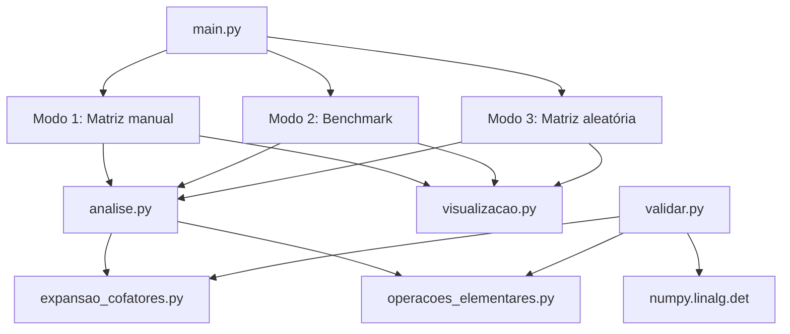

# Guia de Apresentação + Resumo do Código

Trabalho Computacional 3 — GAAL  
Determinantes: Expansão por Cofatores vs Operações Elementares

---

## Parte 1 — Resumo completo do código

### Visão geral do fluxo



### Tabela de complexidade

| Método | Ideia central | Complexidade | Adequado para |
|--------|---------------|--------------|---------------|
| Expansão por cofatores | Recursão pela 1ª linha (Laplace) | ~O(n!) | Matrizes pequenas, didática |
| Operações elementares | Triangularização (Gauss + pivô) | ~O(n³) | Matrizes maiores, desempenho |

---

### `expansao_cofatores.py`

**Função:** calcular determinante por expansão de Laplace (cofatores), de forma recursiva.

**Estruturas:**
- `ResultadoExpansaoCofatores`: determinante, histórico, operacoes, chamadas_recursivas.

**Funções principais:**

| Função | Entrada | Saída | Lógica |
|--------|---------|-------|--------|
| `matriz_menor(matriz, i, j)` | matriz n×n, índices i, j | matriz (n-1)×(n-1) | Remove linha `i` e coluna `j`; retorna a submatriz |
| `_determinante_recursivo(...)` | matriz, flags internas | int | Núcleo recursivo (ver abaixo) |
| `determinante_expansao_cofatores(matriz)` | matriz | int | API simples — só o determinante |
| `determinante_expansao_cofatores_detalhado(matriz)` | matriz | `ResultadoExpansaoCofatores` | Com histórico e contadores |

**Lógica de `_determinante_recursivo`:**

1. Incrementa contador de chamadas recursivas.
2. **Caso base 1×1:** retorna `matriz[0][0]`.
3. **Caso base 2×2:** retorna `a*d - b*c` (3 operações contadas).
4. **Caso geral (n ≥ 3):** expande sempre pela **1ª linha** (índice 0):

```
det(A) = Σ(j=0..n-1)  (-1)^j · a[0][j] · det(menor[0][j])
```

Para cada coluna `j`:
- `cofator = (-1) ** j` (equivale a `(-1)^(0+j)`)
- `elemento = matriz[0][j]`
- `menor = matriz_menor(matriz, 0, j)` — remove linha 0 e coluna j
- `det_menor = _determinante_recursivo(menor, ...)` — recursão
- `termo = cofator * elemento * det_menor`
- `determinante += termo`

5. **Histórico:** registrado só nos níveis rasos (profundidade 0 e casos 2×2 visíveis); para n > 3, avisa quantas chamadas recursivas foram feitas.
6. **Contagem de operações:** inclui construção da menor (n² por termo) e multiplicações da recursão.

**Por que O(n!)?** Cada nível gera `n` subproblemas de ordem `n-1`; o número de determinantes calculados cresce fatorialmente.

---

### `operacoes_elementares.py`

**Função:** calcular determinante triangularizando a matriz por eliminação de Gauss com pivotamento parcial.

**Estruturas:**
- `ResultadoOperacoesElementares`: determinante, historico, matriz_triangular, trocas_linhas, operacoes.

**Função principal:** `determinante_operacoes_elementares(matriz, registrar_historico=True)`

**Lógica passo a passo:**

1. Converte a matriz para `float` (trabalho interno).
2. Para cada coluna `k` (de 0 a n-1):
   - **Pivotamento parcial:** escolhe a linha com maior `|valor|` na coluna `k` (a partir da linha k).
   - Se o pivô for ~0 → coluna inteira nula → **determinante = 0** (retorno antecipado).
   - Se pivô ≠ linha k → **troca linhas**; incrementa contador de trocas (cada troca inverte o sinal do det).
   - **Eliminação:** para cada linha abaixo do pivô, calcula `fator = L_i[k] / pivô` e faz `L_i ← L_i - fator * L_pivô`, zerando a coluna k abaixo do pivô.
3. **Determinante final:**
   - `det = ∏ diagonal[i][i]`
   - Se número ímpar de trocas → `det *= -1`
   - Arredonda para inteiro (matrizes de entrada são inteiras).
4. **Histórico:** matriz após cada troca/eliminação, diagonal final, trocas e determinante.

**Por que O(n³)?** Para cada uma das n colunas, elimina até n linhas, cada uma com até n multiplicações → ~n³ operações.

---

### `analise.py`

**Função:** orquestrar comparação, benchmark e geração de matrizes.

**Estruturas:**
- `ResultadoOrdem`: métricas médias por ordem (tempos, operações, coincidência).
- `ResultadoBenchmark`: listas agregadas para ordens 2..6.

**Funções:**

| Função | Descrição |
|--------|-----------|
| `gerar_matriz_aleatoria(ordem)` | Inteiros entre -9 e 9 |
| `_medir_tempo(func, repeticoes=5)` | Média com `time.perf_counter` |
| `_resultados_coincidem(det_cof, det_ope)` | Compara com tolerância 1e-6 |
| `executar_benchmark(...)` | 5 matrizes por ordem (2..6), seed=42; retorna tempos/ops médios |
| `comparar_metodos_matriz(matriz)` | Roda ambos com histórico; retorna dict com determinantes, tempos, históricos, matriz triangular |

**Fluxo de `comparar_metodos_matriz`:**
1. Chama `determinante_expansao_cofatores_detalhado` (com histórico) e mede tempo.
2. Chama `determinante_operacoes_elementares` (com histórico) e mede tempo.
3. Monta dict unificado para terminal e gráficos.

---

### `visualizacao.py`

**Função:** gerar gráficos matplotlib e salvar em `graficos/`.

| Função | Saída | Conteúdo |
|--------|-------|----------|
| `exibir_figura(fig, nome)` | PNG + opcional `plt.show()` | Salva sempre; exibe se backend interativo |
| `exibir_painel_benchmark(resultado)` | `graficos/benchmark.png` | 4 painéis: tempo (log), operações (log), speedup, resumo textual |
| `exibir_analise_matriz(matriz, comparacao)` | `graficos/analise_matriz.png` | Matriz inicial, triangular, métricas e barra de tempo |

**Speedup:** `tempo_cofatores / tempo_operacoes` — quanto maior, mais rápido é o método elementar.

---

### `main.py`

**Função:** menu interativo no terminal.

**Modos:**

| Opção | Função | O que faz |
|-------|--------|-----------|
| 1 | `modo_matriz_manual()` | Lê matriz 2..6, compara métodos, imprime histórico (resumido se longo), abre gráfico |
| 2 | `modo_benchmark()` | Roda benchmark, imprime tabela no terminal, abre `benchmark.png` |
| 3 | `modo_matriz_aleatoria()` | Gera matriz da ordem escolhida e analisa |
| 0 | — | Encerra |

**Auxiliares:** `ler_ordem()`, `ler_matriz()`, `imprimir_matriz()`, `imprimir_historico()` (limita a 8 etapas no terminal).

---

### `validar.py`

**Função:** provar corretude dos dois métodos contra referência externa.

- Compara `determinante_expansao_cofatores` e `determinante_operacoes_elementares` com `numpy.linalg.det`.
- **Casos fixos:** 2×2, identidade 2×2, diagonal 3×3, matriz singular 3×3 (1 2 3 / 4 5 6 / 7 8 9), outra singular.
- **Aleatórios:** 10 matrizes por ordem (2..6), seed=42.
- **Total:** 55 testes; exit code 1 se algum falhar.

---

### `requirements.txt`

- `matplotlib`, `numpy` — gráficos e validação.
- `pydantic` — dependência legada do projeto.

---

## Parte 2 — Roadmap de apresentação (≤ 5 minutos)

### Comandos para a demo

```bash
cd gaal-matrizes
source .venv/bin/activate          # Linux/macOS
pip install -r requirements.txt    # se ainda não instalou
python main.py
python validar.py
```

Abrir os PNGs gerados: `graficos/analise_matriz.png`, `graficos/benchmark.png`.

---

### Matrizes sugeridas para demonstração

**Matriz 3×3 (determinante ≠ 0, boa para histórico):**
```
2  1  3
0  4  1
1  2  5
```

**Matriz singular (determinante = 0):**
```
1  2  3
4  5  6
7  8  9
```
Linhas linearmente dependentes — ambos os métodos retornam 0.

**Matriz 4×4 (mostra trocas de linha no método elementar):**
```
1  3  2  8
8  3  1  7
2  8  1  4
9  2  8  1
```

---

### Roteiro cronometrado

| Tempo | Bloco | O que fazer | O que provar |
|-------|-------|-------------|--------------|
| **0:00–0:30** | Abertura | Apresentar Trabalho 3: calcular determinante por cofatores e por operações elementares; comparar resultados e desempenho | Contexto do PDF |
| **0:30–1:30** | Cofatores | Abrir `expansao_cofatores.py`; explicar fórmula Laplace e recursão; **Modo 1** com matriz 3×3; mostrar histórico (termos por coluna) | Lógica recursiva implementada |
| **1:30–2:30** | Op. elementares | Abrir `operacoes_elementares.py`; explicar pivô, troca de linha, eliminação, produto da diagonal; mesmo teste — histórico com matriz triangular | Segundo método exigido pelo PDF |
| **2:30–3:30** | Benchmark | **Modo 2**; mostrar terminal + `benchmark.png` (curvas em log, speedup crescente) | Diferença de desempenho a partir da ordem 4 |
| **3:30–4:15** | Validação | Rodar `python validar.py`; mostrar "55 testes, 0 erros" | Resultados corretos (referência numpy) |
| **4:15–5:00** | Análise obrigatória | Responder as 4 questões (cola abaixo), apontando gráfico/validação | Fechamento alinhado ao relatório |

---

### Respostas rápidas (cola)

**1. Os resultados coincidiram?**  
Sim. Para toda matriz testada, cofatores e operações elementares dão o mesmo determinante.  
*Evidência:* `python validar.py` → 55 testes OK; Modo 1 mostra "Coincidem: Sim".

**2. Qual método foi mais eficiente?**  
Operações elementares — menos tempo e menos operações, especialmente a partir da ordem 4.  
*Evidência:* gráfico `benchmark.png` (tempo e operações em escala log; barras de speedup > 1).

**3. Por que cofatores se torna inviável para matrizes maiores?**  
Complexidade ~O(n!): cada expansão gera n subproblemas recursivos; operações explodem (ex.: ordem 6 → milhares de ops vs ~100 no método elementar).  
*Evidência:* tabela do benchmark no terminal ou curva de operações no gráfico.

**4. Em quais situações cofatores ainda é pedagogicamente útil?**  
Matrizes 2×2 e 3×3; entender menores, cofatores e definição formal do determinante; exercícios teóricos e matriz adjunta/inversa clássica.  
*Evidência:* histórico do Modo 1 mostra cada termo `(-1)^j · a[0][j] · det(menor)` de forma explícita.

---

### Checklist antes de apresentar

- [ ] `.venv` ativo e dependências instaladas
- [ ] `python validar.py` rodou sem erros
- [ ] `graficos/benchmark.png` gerado (Modo 2)
- [ ] Matriz de demo anotada (3×3 acima)
- [ ] Abas abertas: `expansao_cofatores.py`, `operacoes_elementares.py`, terminal com `main.py`
